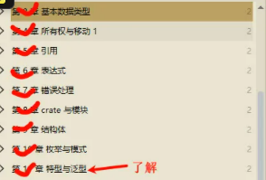
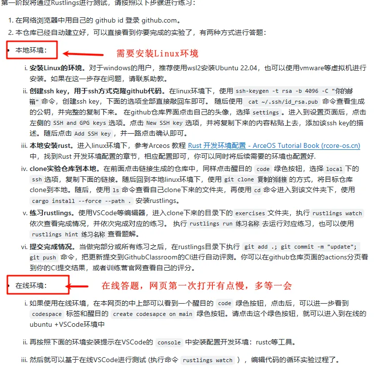

# 基础学习阶段

## 学习资料汇总

<https://github.com/169LI/Rust_study>

## 笔记

按照日期每周上传自己的本周学习内容到对应文件夹，截图、文字均可。

## 基础学习安排

1、安装环境、自由选择IDE(vscode、Rustrover等)和平台（windows、linux）

2、学习Rust基础：（看视频是最快上手Rust的，书中都讲的太细，不用看书。遇到不会的也可以问一下大模型）

3、要求: 看的懂简单代码，编译器简单报错可以修改。

os训练营中基础阶段实验作业<https://opencamp.cn/os2edu/camp/2025spring/stage/1（该链接页面最下面）中代码修改，会改就行。>

## 编程设计训练

1、详细信息看项目一文件夹内

