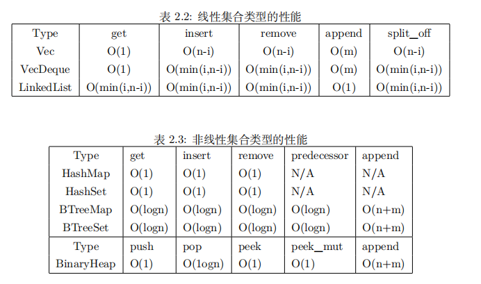

# Rust 数据结构的性能
## 标量和复合类型
标量类型代表一个单独的值，复合类型是标量类型的组合。
- `Rust` 中有四种基本的标量类型：**整型、浮点型、布尔型、字符型；**
- 有两种复合类型：**元组、数组**。
标量类型都是最基本的和内存结合最紧密的原生类型，运算效率非常高，可以视为 `O(1)`，而复合类型则复杂一些，
复杂度随其数据规模而变化。
```rust
  fn main() {
    let a: i8 = -2;
    let b: f32 = 2.34;
    let c: bool = true;
    let d: char = 'a';
  
    let x: (i32, f64, u8) = (200, 5.32, 1);
    let xi32 = x.0;
    let xf64 = x.1;
    let xu8 = x.2;
   }
```
元组是将多个各种类型的值组合成一个复合类型的数据结构。元组长度固定，一旦声明，
其长度不能增加或缩小。元组的索引从` 0` 开始，直接用`“.”`号获取值。

数组一旦声明，长度也不能增减，但与元组不同的是，数组中每个元素的类型必须相同。
数组非常有用，基于数组的切片其实更灵活，所以也更常用。

```rust
fn main() {
    let months = ["January", "February", "March", "April", 
                "May", "June", "July", "August", "September", 
                "October", "November", "December"];
    let first_month = months[0];
    let halfyear = &months[..6];
    
    let mut monthsv = Vec::new();
    for month in months { monthsv.push(month); }
 }
```
`Rust` 里的其他数据类型都是由标量和复合类型构成的集合类型，如 `Vec`、`HashMap` 等。
`Vec` 类型是标准库提供的一个允许增加和缩小长度的类似数组的集合类型。

## 集合类型
Rust 的集合类型是基于标量和复合类型构造的，其中又分为**线性**和**非线性**两类。
- **线性的集合类型有**：`String、Vec、VecDeque、LinkedList`
- **非线性集合类型的有**：`HashMap、BTreeMap、HashSet、BTreeSet、BinaryHeap`。

