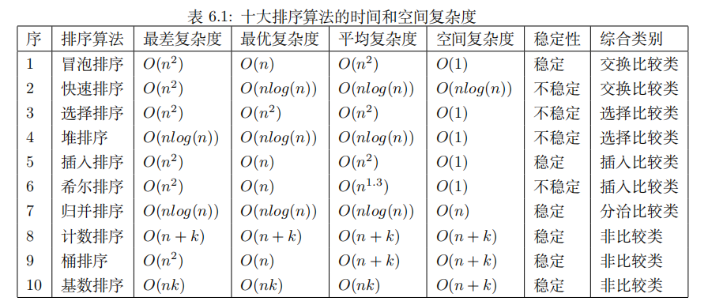

# 排序
排序算法排序算法是将一组数据按某种顺序排列的算法。
常见的排序算法有：**冒泡排序、选择排序、插入排序、归并排序、快速排序、堆排序、希尔排序、基数排序、桶排序和计数排序**等。
还有一些不常用的排序算法，如：**鸡尾酒排序、梳排序、树排序**等。
## 目录
- [冒泡排序](#冒泡排序)
- [选择排序](#选择排序)
- [插入排序](#插入排序)
- [归并排序](#归并排序)
- [快速排序](#快速排序)
- [堆排序](#堆排序)
- [希尔排序](#希尔排序)
- [基数排序](#基数排序)
- [桶排序](#桶排序)
- [计数排序](#计数排序)

## 冒泡排序

- **原理**：通过相邻元素两两比较并交换，将最大（或最小）元素逐步“冒泡”到数组一端，重复直到排序完成。
- **时间复杂度**：最差/平均 `O(n²)`，最好` O(n)`（当数组已排序）。
- **空间复杂度**：`O(1)`，原地排序。
- **稳定性**：稳定（相等元素相对顺序不变）。
- **优点**：实现简单，易于理解，适合小规模数据。
- **缺点**：效率低，交换操作频繁，不适合大数据量。

[冒泡排序](./data_struct/sort_algorithm/src/bubble_sort.rs)

## 选择排序

- **原理**：每次从未排序部分选择最小（或最大）元素，将其交换到已排序部分的末尾，逐步扩展已排序区域。
- **时间复杂度**：最差/平均/最好 `O(n²)`，始终需比较所有元素。
- **空间复杂度**：`O(1)`，原地排序。
- **稳定性**：不稳定（交换可能打乱相等元素的相对顺序）。
- **优点**：实现简单，交换次数少（最多`n-1 `次）。
- **缺点**：效率低，不适合大数据量，缺乏稳定性。

[选择排序](./data_struct/sort_algorithm/src/selection_sort.rs)

## 插入排序

- **原理**：将数组分为已排序和未排序两部分，逐一将未排序部分的元素插入到已排序部分的正确位置，类似整理扑克牌。
- **时间复杂度**：最差/平均 `O(n²)`，最好 `O(n)`（当数组近乎有序）。
- **空间复杂度**：`O(1)`，原地排序。
- **稳定性**：稳定（插入时保持相等元素相对顺序）。
- **优点**：实现简单，适合部分有序或小规模数据，适应增量排序。
- **缺点**：效率低，大规模数据性能差。

[插入排序](./data_struct/sort_algorithm/src/insertion_sort.rs)

## 归并排序
- **原理**：采用分治法，将数组递归拆分为小块，直到不可再分，然后合并有序子数组，最终完成排序。
- **时间复杂度**：最差/平均/最好 `O(n log n)`，性能稳定。
- **空间复杂度**：`O(n)`，需要额外空间存储临时数组。
- **稳定性**：稳定（合并时保持相等元素的相对顺序）。
- **优点**：性能稳定，适合大数据和链表排序，复杂度不随数据分布变化。
- **缺点**：非原地排序，空间开销较大，合并过程需额外内存。

[归并排序](./data_struct/sort_algorithm/src/merge_sort.rs)

## 快速排序

- **原理**：采用**分治法**，选择一个基准（`pivot`），将数组分区为小于和大于基准的两部分，递归对子数组排序。
- **时间复杂度**：
  - 平均：`O(n log n)`。
  - 最差：`O(n²)`（当数组已排序或基准选择极差）。
  - 最好：`O(n log n)`。
- **空间复杂度**：`O(n log n)`（递归栈空间，平均 `O(log n)`）。
- **稳定性**：不稳定（分区交换可能打乱相等元素的相对顺序）。
- **优点**：平均性能极佳，原地排序，适合内存排序，缓存友好。
- **缺点**：最差情况性能差（需优化基准选择），不稳定。

[快速排序](./data_struct/sort_algorithm/src/quick_sort.rs)

## 堆排序
- **原理**：基于堆数据结构（通常是最大堆），先构建最大堆，然后反复提取堆顶（最大元素）并调整堆，直到所有元素有序。
- **时间复杂度**：最差/平均/最好 `O(n log n)`，性能稳定。
- **空间复杂度**：`O(1)`，原地排序。
- **稳定性**：不稳定（堆调整可能打乱相等元素的相对顺序）。
- **优点**：原地排序，时间复杂度稳定，适合固定内存场景。
- **缺点**：不稳定，缓存不友好（堆操作跳跃式访问），实际性能可能不如快速排序。

[堆排序](./data_struct/sort_algorithm/src/heap_sort.rs)

## 希尔排序

- **原理**：一种改进的插入排序，通过设定增量（`gap`）将数组分组，逐步缩小增量进行插入排序，最终实现整体排序。
- **时间复杂度**：
  - 最差：`O(n²)`（最差增量序列）。
  - 平均：`O(n^(4/3))` 或 `O(n log n)`（取决于增量序列）。
  - 最好：`O(n log n)`（优化增量序列）。
- **空间复杂度**：`O(1)`，原地排序。
- **稳定性**：不稳定（分组交换可能打乱相等元素的相对顺序）。
- **优点**：比插入排序快，适合中等规模数据，逐步减少逆序对。
- **缺点**：时间复杂度依赖增量序列选择，实际性能不如快速排序或归并排序。

[希尔排序](./data_struct/sort_algorithm/src/shell_sort.rs)

## 基数排序

- **原理**：非比较排序算法，按位（从低位到高位）分配元素到桶中，结合计数排序或桶排序，逐步完成排序。
- **时间复杂度**：
  - 最差/平均/最好：`O(d * (n + k))`，其中 `d` 是数字的位数，`k` 是基数（通常为 10 或 256）。
- **空间复杂度**：`O(n + k)`，需要额外空间存储桶。
- **稳定性**：稳定（分配和收集过程保持相等元素顺序）。
- **优点**：线性时间复杂度，适合多位数或字符串排序。
- **缺点**：空间开销较大，依赖位数和基数，不适合浮点数或范围过大的数据。

[基数排序](./data_struct/sort_algorithm/src/radix_sort.rs)

## 桶排序

- **原理**：非比较排序算法，将元素按值范围分配到多个桶中，每个桶内单独排序（通常用插入排序），最后合并所有桶。
- **时间复杂度**：
  - 最差：`O(n²)`（所有元素落入一个桶，退化为插入排序）。
  - 平均：`O(n + k)`（假设均匀分布，`k` 为桶数量）。
  - 最好：`O(n)`（元素均匀分布，桶内排序开销小）。
- **空间复杂度**：`O(n + k)`，需要额外空间存储桶。
- **稳定性**：稳定（桶内排序和收集保持相等元素顺序）。
- **优点**：线性时间复杂度，适合均匀分布数据。
- **缺点**：对数据分布敏感，空间开销较大，不适合范围过大的数据。

[桶排序](./data_struct/sort_algorithm/src/bucket_sort.rs)

## 计数排序
- **原理**：非比较排序算法，通过统计元素出现次数，计算每个元素的最终位置，直接赋值完成排序。
- **时间复杂度**：
  - 最差/平均/最好：`O(n + k)`，其中 `k` 是元素范围（最大值与最小值的差 + 1）。
- **空间复杂度**：`O(n + k)`，需要额外空间存储计数数组。
- **稳定性**：稳定（按原始顺序处理相等元素）。
- **优点**：线性时间复杂度，适合固定范围整数。
- **缺点**：仅适用于有限范围数据，不适合浮点数或范围过大的数据。

[计数排序](./data_struct/sort_algorithm/src/count_sort.rs)