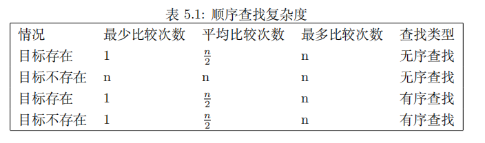
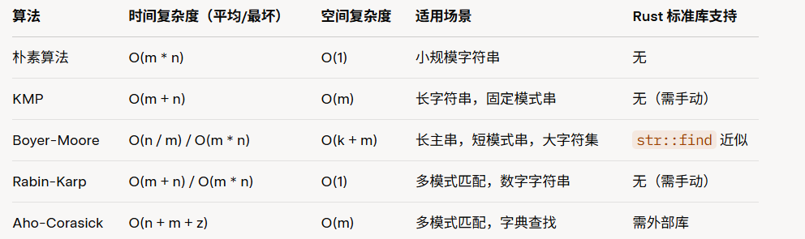

# 查找

## 目录
 ### [顺序查找](#顺序查找)：简单，适合小数据或无序集合，使用 `find` 或 `position`
 ### [二分查找](#二分查找)：高效，适合有序数据，使用 `binary_search`
 ### [哈希查找](#哈希查找)：快速，适合键值对或存在性检查，使用 `HashMap`/`HashSet`
 ### 字符串查找：`KMP` 等算法适用于模式匹配
 ### 高级场景：根据需求实现插值查找、并行查找等

## 顺序查找

当数据项存储在诸如`Vec`，数组，切片这样的集合中时，数据具有线性关系，因为每个数据项都存储在相对于其他数据项的位置。
在切片中，这些相对位置是数据项的索引值。由于索引值是有序的，可以按顺序访问，所以这样的数据结构也是线性的。
回想前面学习的栈，队列，链表都是线性的。基于这种和物理世界相同的线性逻辑，一种很自然的查找技术就是**线性查找**，或者叫**顺序查找**

- **原理**：逐一比较集合元素与目标值，直到找到或遍历结束。
- **时间复杂度**：平均/最坏 `O(n)`，最好 `O(1)`。
- **空间复杂度**：`O(1)`，仅需常数空间。
- **适用场景**：无序数据、小规模数据、单次查找。
- **优点**：实现简单、无需排序、支持任意数据类型。
- **缺点**：效率低，不适合大数据或频繁查找。
- **Rust 实现**：使用 `iter().position()` 或 `find()`，支持泛型，安全高效。

[顺序查找演示](./data_struct/search_algorithm/src/sequential_search_example.rs)

[顺序查找实现](./data_struct/search_algorithm/src/sequential_search_achieve.rs)

## 二分查找
二分查找是一种高效的查找算法，适用于**有序数据集合**。
其基本思想是将查找区间不断减半，通过比较中间元素与目标值的大小，决定继续在左半部分还是右半部分查找，直到找到目标值或查找区间为空。

- **原理**：在有序集合中，比较中间元素与目标值，根据大小关系排除一半元素，重复直到找到或范围为空。
- **时间复杂度**：平均/最坏` O(log n)`，最好 `O(1)`。
- **空间复杂度**：`O(1)`（迭代实现），`O(log n)`（递归实现）。
- **适用场景**：有序数组或切片、大规模数据、频繁查找。
- **优点**：高效，适合大数据量，时间复杂度低。
- **缺点**：要求数据预先排序，不适用动态数据或无序集合。
- **Rust 特性**：标准库提供 `binary_search` 等 `API`，泛型支持，安全高效。

[二分查找演示](./data_struct/search_algorithm/src/binary_search_example.rs)

[二分查找实现](./data_struct/search_algorithm/src/binary_search_achieve.rs)

[插值查找](./data_struct/search_algorithm/src/interpolation_search.rs)

## 哈希查找
哈希查找是一种基于哈希表的数据结构（如 `HashMap` 或 `HashSet`）的查找算法，通过将键映射到哈希值实现快速定位

（这里以**线性探测法**为例）

- **原理**：通过哈希函数将键映射到索引，访问哈希表中的槽位查找值。
- **时间复杂度**：
  - 平均：`O(1)`（假设哈希函数均匀，冲突少）。
  - 最坏：`O(n)`（冲突严重时，退化为线性查找）。
- **空间复杂度**：`O(n)`，存储键值对或元素。
- **适用场景**：快速键值映射、检查元素存在性、频繁查找。
- **优点**：平均情况下极快，适合动态数据。
- **缺点**：依赖哈希函数质量，冲突可能降低性能，空间开销较大。
- **Rust 特性**：标准库提供 `HashMap` 和 `HashSet`，高效、安全，支持泛型

[哈希查找演示](./data_struct/search_algorithm/src/hash_search_example.rs)

[哈希查找实现](./data_struct/search_algorithm/src/hash_search_achieve.rs)

[基于拉链法的哈希查找](./data_struct/search_algorithm/src/chaining_hash_search.rs)

## 字符串查找
字符串查找是计算机科学中的一个重要领域，涉及在文本中查找特定模式或子字符串的方法。
其中，`KMP（Knuth-Morris-Pratt）`算法是一种高效的字符串查找算法，适用于模式匹配。

以下是常用的字符串查找算法及其特点：

- 朴素算法` (Naive String Matching)`：
  - **原理**：逐位比较主串和模式串的所有可能位置。
  - **时间复杂度**：`O(m * n)`，`m` 为模式串长度，`n` 为主串长度。
  - **空间复杂度**：`O(1)`。
  - **优点**：简单，无需预处理。
  - **缺点**：效率低，尤其当主串和模式串长且匹配失败频繁时。
- `KMP` 算法 `(Knuth-Morris-Pratt)`：
  - **原理**：利用模式串的前缀信息（部分匹配表），避免重复比较已匹配的部分。
  - **时间复杂度**：`O(m + n)`，预处理` O(m)`，查找 `O(n)`。
  - **空间复杂度**：`O(m)`，存储部分匹配表。
  - **优点**：高效，适合长字符串，避免回溯。
  - **缺点**：实现稍复杂，需预处理。

[字符串查找演示](./data_struct/search_algorithm/src/string_search_example.rs)

[KMP 实现](./data_struct/search_algorithm/src/kmp_search.rs)

