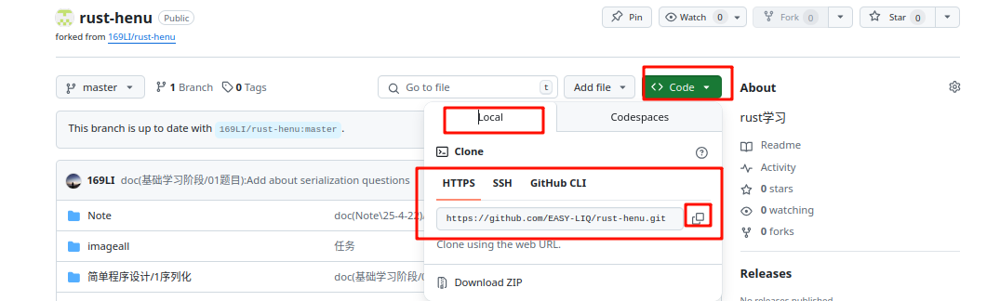
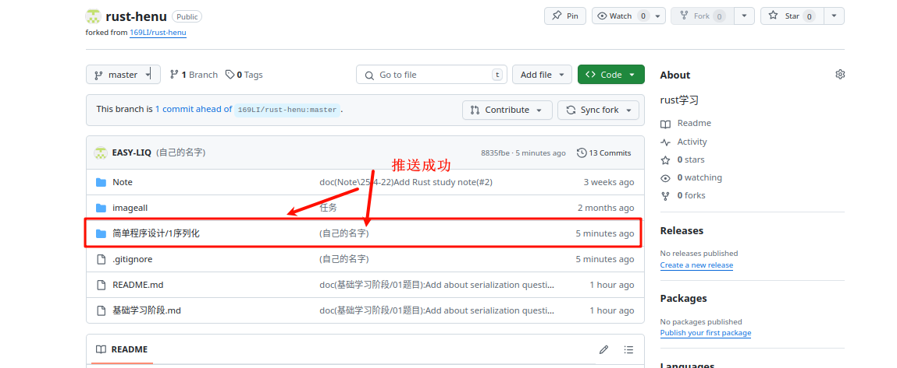
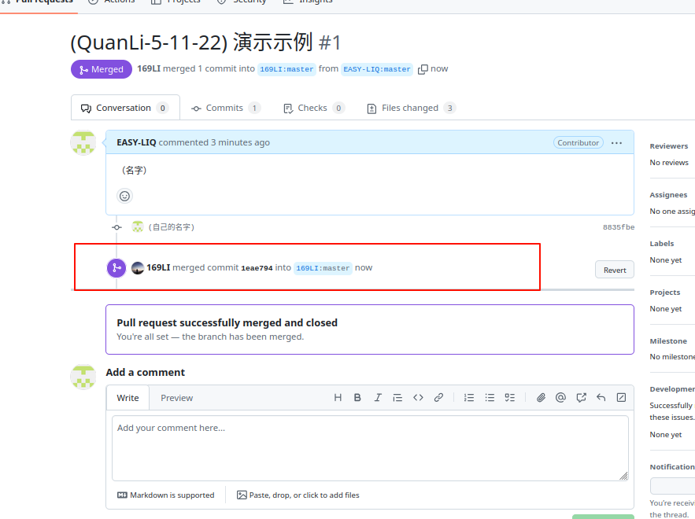
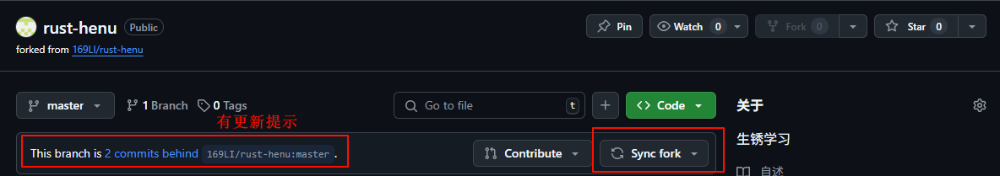

# github上如何PR推送代码
## 1、注册自己github账号
    自己探索
## 2、配置自己git提交信息

- 安装git
- 设置本地 Git 账户
```git
git config --global user.name "你的名字"
git config --global user.email "你的邮箱"
```
- 查看
  `git config --list`
## 3、fork要推送的项目


## 4、克隆自己fork的项目到本地


## 5、修改代码并提交到自己的仓库

添加自己的文件就行，不要修改其他文件 可能会造成冲突

这里可以使用自己ide提供的上传命令，比如 Rustrover：


比如vscode（也有插件如gitlen或`自带的源代码管理`也可以达到同样的功能）或者通过命令行使用git命令上传，自己去查询命令(下面给一个简单示例)
```git
git add .
git commit -m "提交信息"
git push origin --  --
```
# 6、提交PR


# 7、等待审核

等待我审核合并后 你就可以删库了（把你仓库的这个删掉，以后再提交，重新fork）或者保留，下次提交时记得先sync两个地方后，再添加你的代码，再上传和PR
sync以下两个地方：
1. 自己fork的仓库

2. 本地Clone的仓库

选择 `传入更改合并到当前分支` 即可.


