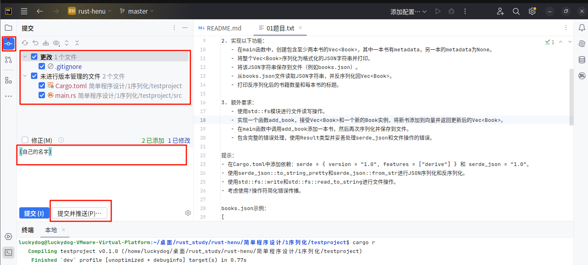

# github上如何推送代码

两种情况：

# 一、如果是增添新的文件，给我说一下，我邀请你加入这个仓库。然后直接将这个库克隆到本地，添加新文件后可以直接提交即可：


1. 首先需要注册自己的GitHub账号（参考二的1）
2. 配置Git提交信息（参考二的2）
3. 等待仓库管理员邀请你加入仓库
4. 接受邀请后，克隆仓库到本地：
例如：
```git
git clone https://github.com/169LI/rust-henu.git
```
5. 在本地添加新文件
6. 点击提交

7. 推送


注意事项：
- 如果推送时出现下图的情况，说明管理员还没有邀请你加入仓库

- 提交信息要清晰描述添加的内容
- 提交前先拉取最新代码：`git pull origin main`


# 二、 如果是**修改已有的文件**需要`PR`。也就是下面的步骤：
## 如果有该仓库的权限，只需要进行第一种情况的6和7
## 1、注册自己github账号
    自己探索
## 2、配置自己git提交信息

- [安装 git](https://blog.csdn.net/mukes/article/details/115693833)
- 设置本地 Git 账户
```git
#名字拼写就可以  邮箱设不设置都可以  有时需要添加ssh密钥什么的需要自己搜(不加ssh密钥可能每次commit都需要输入账号和密码)
git config --global user.name "你的名字" 
git config --global user.email "你的邮箱"
```
- 查看配置是否成功：
```git
git config --list
```

## 3、Fork项目
1. 访问项目地址：`https://github.com/169LI/rust-henu`
2. 点击右上角的"Fork"按钮
3. 选择你的账号作为目标位置


Fork后的仓库会出现在你的账号下：


## 4、克隆Fork的项目到本地

1. 在你的Fork仓库页面点击"Code"按钮
2. 复制HTTPS链接


3. 在本地执行克隆命令：
```git
git clone [你复制的https链接]
```


## 5、修改代码并提交到自己的仓库


如果不会处理冲突，就只添加自己要添加的文件就行，不要修改其他文件。 

这里可以使用自己ide提供的上传命令，比如 Rustrover：




比如vscode（也有插件如`gitlen`或自带的`源代码管理`也可以达到同样的功能）或者 通过`命令行`使用git命令上传，自己去学习`git`命令(下面给一个简单示例)
```git
git add .
git commit -m "提交信息"
git push origin --  --
```
# 6、提交PR


# 7、等待审核


等待我审核合并后就可以看到你的修改合并到主仓库了。

下次提交时记得先`sync`两个地方后，再添加你的代码，再`上传`和`PR`

`sync`以下两个地方：

1. sync自己fork的仓库(github)

2. Clone的仓库(本地)

选择 `传入更改合并到当前分支` 即可.


